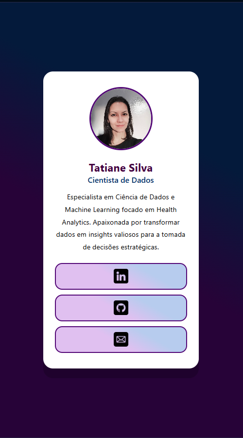

# 📇 Cartão de Visitas Profissional Digital

Um mini projeto responsivo desenvolvido como parte da disciplina de **Desenvolvimento Front-End**, com o objetivo de criar um cartão de visitas digital interativo e moderno para apresentação profissional.

---

## 📸 Demonstração

O projeto consiste em um cartão estilizado e centralizado na tela, contendo foto de perfil, descrição sobre mim, área de atuação e links diretos para minhas principais redes e formas de contato:

* **LinkedIn:** [tatiane-silva-data](https://www.linkedin.com/in/tatiane-silva-data)
* **GitHub:** [tatianesilva-ads](https://github.com/tatianesilva)
* **E-mail:** `tatianegsilva.ps@gmail.com`

---

## 🚀 Tecnologias Utilizadas

O projeto foi construído utilizando tecnologias fundamentais da Web:

* **HTML5:** Estruturação semântica da página (`<div>`, `<ul>`, `<li>`, `<a>`, ``, etc.).
* **CSS3:** Estilização visual, incluindo:
  * Layout centralizado.
  * Esquema de cores e tipografia profissional.
  * **Design Responsivo:** Uso de Media Queries (`@media (max-width: 400px)`) para adaptação perfeita a telas de smartphones.
  * Efeitos visuais e espaçamentos dinâmicos (`padding`, `width: 90%`).

---

## 📱 Responsividade

O layout foi projetado seguindo práticas de design responsivo para garantir uma boa experiência em qualquer dispositivo:

```css
@media (max-width: 400px) {
  .card {
    width: 90%;
    padding: 24px 16px;
  }
}

HTML
## 📸 Demonstração

